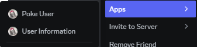

# Overview of Context Menu Commands

**Dollar** provides a set of **Context Menu Commands** that enhance the user experience by enabling quick actions directly from the Discord right-click menu. These commands are accessible under the "Apps" submenu when right-clicking on a user or a message, offering convenient tools for server moderation and user management.

## Key Features

- **Intuitive Access**: Context menu commands are seamlessly integrated into Discord's UI, allowing users to execute commands without typing.
- **Ease of Use**: No need to remember specific command prefixes or syntax. Just right-click and select the desired action.
- **Moderation and Utility**: Focused on improving moderation capabilities and user management.

## Why Use Context Menu Commands

- **Efficiency**: Execute actions with just a few clicks, reducing the time spent managing the server.
- **Convenience**: Access commands without disrupting the flow of conversation.
- **Enhanced Moderation**: Equip moderators with quick tools to handle issues effectively.

## How to Access Context Menu Commands

1. Right-click on a user or message in Discord.
2. Navigate to the **Apps** submenu.
3. Select the desired command from the list.

With **Dollar's Context Menu Commands**, moderation and user management become faster and more accessible, empowering users to maintain a well-organized and enjoyable server environment.
